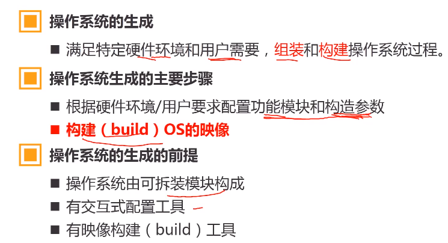

# 操作系统

## 分时系统的特点

### 多路调制性

◆多用户联机使用同一台计算机

### 独占性

◆用户感觉独占计算机

### 交互性

◆及时响应用户的请求

# 操作系统的逻辑结构

逻辑结构：OS的设计和实现思路

## 逻辑结构的种类

### 1.整体式结构

​	以模块为基本单位

​	特点：模块设计，编码和调试独立   模块调用自由   模块通信多以全局变量形式完成

​	缺点：信息传递随意，维护和更新困难

### 2.层次式结构

#### 分层原则

硬件相关——最底层
外部特性——最外层
中间层——调用次序或消息传递顺序
共性的服务——较低层
活跃功能——较低层

优点：

结构清晰，避免循环调用。
整体问题局部化，系统的正确性容易保证。
有利于操作系统的维护、扩充、移植。

### 3.微内核结构（客户/服务器结构）

操作系统=微内核+核外服务器

微内核： 足够小，提供OS最基本的核心功能和服务
	1.实现与硬件紧密相关的处理
	2.实现一些叫基本的功能
	3.负责客户和服务器间的通信

核外服务器：完成OS的绝大部分服务功能，等待应用程序提出请求
	由若干服务器或进程共同构成
	例如：进程/线程服务器，虚存服务器，设备管理服务器等，以进程形式运行在用户态。

## 第二章 CPU的态（CPU的工作状态，对资源和指令使用权限的描述）

## 态的分类

### 	1.核态（Kernel mode）

​				能够访问所有资源和执行所有指令

​				管理程序/OS内核

### 	2.用户态（User mode，目态）

​				仅能访问部分资源，其它资源受限。

​				用户程序

### 	3.管态

​				介于核态和用户态之间

## 用户态和核态之间的转换

### 	用户态向核态转换

​			用户请求OS提供服务

​			发生中断

​			用户进程产生错误（内部中断）

​			用户态企图执行特权指令

### 	核态向用户态转换情形

​			一般是执行中断返回：IRET

## 中断

### 中断源和中断类型

​	引起系统中断的事件称为中断源
​		中断类型:		强迫性中断和自愿中断
​		强迫性中断：程序没有预期：例：IO、外部中断
​		自愿中断：程序有预期的。例：执行访管指令

​	中断类型
​	外中断（中断）和内中断（俘获）
​	外中断；由CPU外部事件引起。例：I/O.，外部事情。
​	内中断：由CPU内部事件引起。例：访管中断、程序中断

​	外中断：不可屏蔽中断和可屏藏中断
​	不可屏蔽中断：中断的原因很紧要，CPU必须响应
​	可屏蔽中断：中断原因不很紧要，CPU可以不响应

# 第三章 操作系统用户界面

## 3.1 操作系统启动过程

### 	3.1.1BIOS和主引导记录MBR

### 3.1.2 操作系统启动过程

# 操作系统的生成

​	

# 3.3用户界面

用户界面的定义：OS提供给用户控制计算机的机制，又称用户接口。

