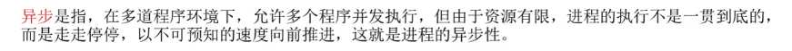
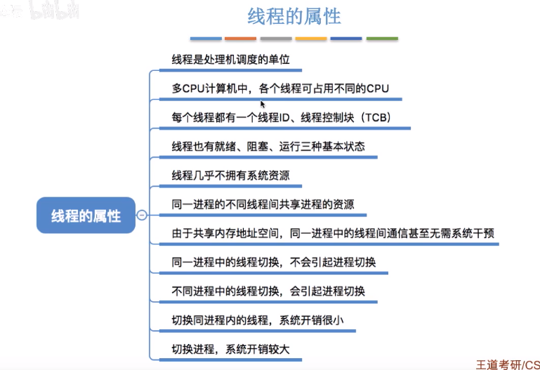

# 																	王道操作系统

## 并发，共享，虚拟，异步

# 操作系统的发展和分类

### 手工阶段

主要缺点：用户独占全机。人机速度矛盾导致资源利用率极低

### 批处理阶段--单道批处理阶段

引入脱机输入/输出技术（用磁带完成），并监督程序负责控制作业的输入、输出

主要优点：缓解了一定程度的人机速度矛盾，资源利用率有所提升。

主要缺点：内存中仅能有一道程序运行，只有该程序运行结束之后才能调入下一道程序。CPU有大量的时间是在空闲等待/0完成。资源利用率依然很低。

### 批处理阶段--多道批处理阶段（操作系统诞生）

主要优点：多道程序并发执行，共享计算机资源。资源利用率大幅提升，CPU和其他资源保持“忙碌”状态，系统吞吐量增大。

主要缺点：用户响应时间长，没有人机交互功能（用户提交自己的作业之后就只能等待计算机处理完成，中间不能控制自己的作业执行）

### 分时操作系统

分时操作系统：计算机以时间片为单位轮流为各个用户/作业服务，各个用户可通过终端与计算机进行交互。4

主要优点：用户请求可以被即时响应，解决了人机交互问题。允许多个用户同时使用一台计算机，并且用户对计算机的操作相互独立，感受不到别人的存在。
主要缺点：不能优先处理一些紧急任务。操作系统对各个用户/作业都是完全公平的，循环地为每个用户/作业服务一个时间片，不区分任务的紧急性。

### 实时操作系统

主要优点：能够优先响应一些紧急任务，某些紧急任务不需时间片排队。
在实时操作系统的控制下，计算机系统接收到外部信号后及时进行处理，并且要在严格的时限内处理完事件。实时操作系统的主要特点是及时性和可靠性

## 

## os的运行机制和体系结构

## 

## 中断

## 系统调用

# 进程的定义组成组织方式特征

## 进程通信（指进程之间的信息交换）

进程是分配系统资源的单位（包括内存地址空间），因此各进程拥有的内存地址空间相互独立。

为了保证安全，一个进程不能直接访问另一个进程的地址空间。

## 线程，多线程模型

## 处理机调度

## 

进程调度（低级调度），就是按照某种算法从就绪队列中选择一个进程为其分配处理机。

